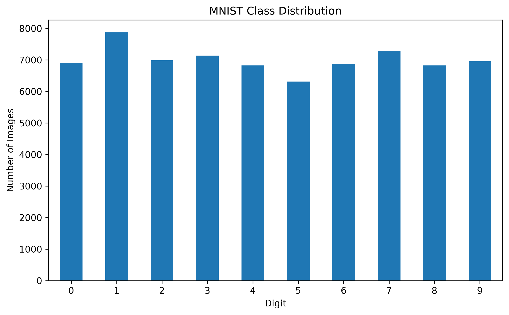
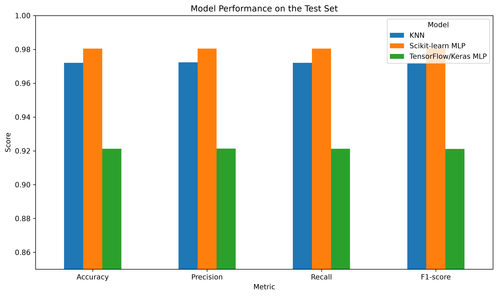
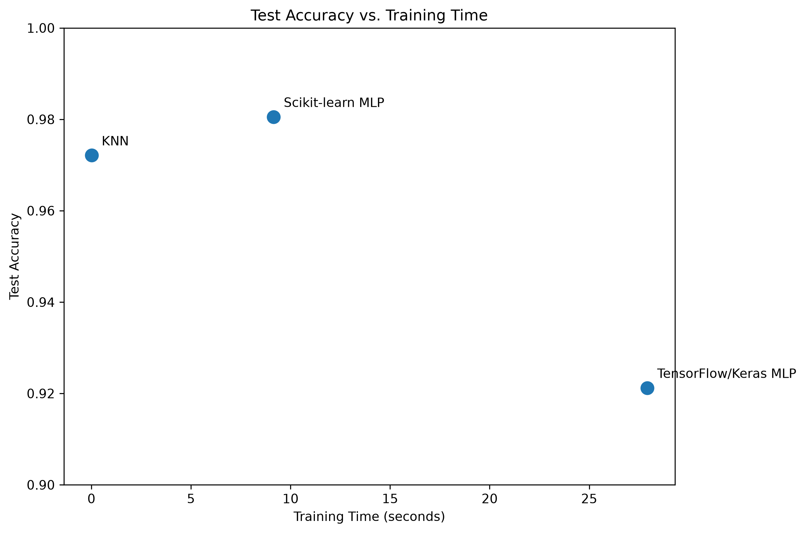
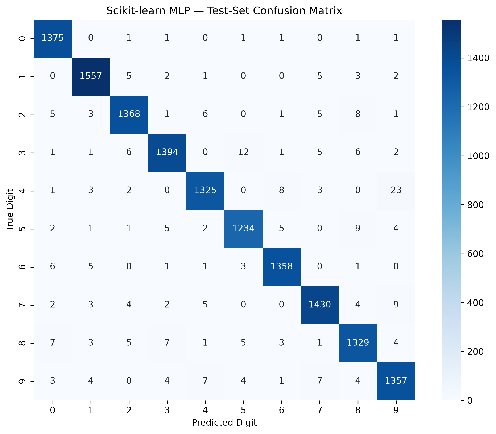
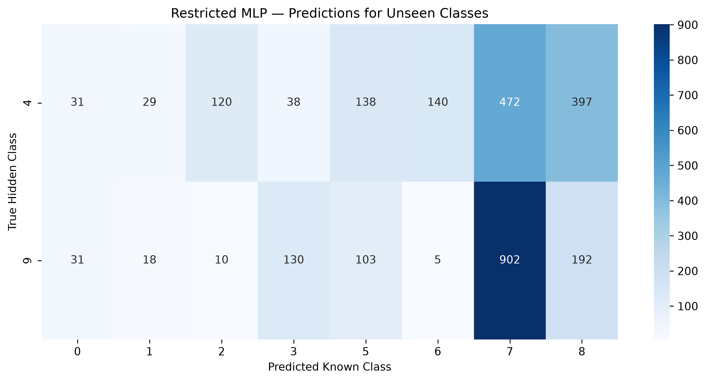
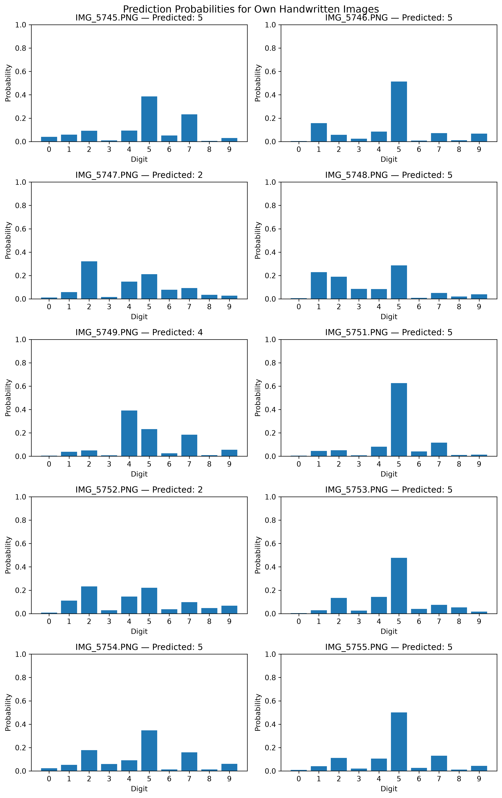

# MNIST Multiclass Predictive Pipeline

A machine learning pipeline for handwritten digit classification using the MNIST dataset, with model comparison, independent test evaluation, and robustness experiments on unseen classes and handwritten images outside the original dataset.

## Project Overview

This project develops and evaluates machine learning models for multiclass handwritten digit classification.

The main objective is to investigate how different predictive models perform on the MNIST dataset and how their performance changes when they are exposed to situations that differ from the ideal training conditions.

The project covers the complete workflow from data exploration and preprocessing to model development, independent evaluation, and robustness testing.

Three predictive models were developed and compared:

* K-Nearest Neighbors (KNN)
* Scikit-learn Multilayer Perceptron (Scikit-learn MLP)
* TensorFlow/Keras Multilayer Perceptron (TensorFlow/Keras MLP)

The Scikit-learn MLP achieved the strongest performance on the independent MNIST test set and was therefore selected for the robustness experiments.

## Problem

Handwritten digit recognition is a multiclass classification problem in which an input image must be assigned to one of ten possible classes, from 0 to 9.

Although a model can achieve high accuracy on data that follows the same distribution as its training set, real-world inputs may differ from the original data. This project therefore investigates not only standard classification performance but also how the selected model behaves when:

1. Some classes are completely absent from training.
2. The model is tested exclusively on those unseen classes.
3. The model receives handwritten images created outside the MNIST dataset.

These experiments help demonstrate practical limitations related to closed-set classification and changes in data distribution.

## Dataset

The project uses the MNIST handwritten digit dataset obtained through OpenML.

MNIST contains:

* 70,000 grayscale images
* 10 digit classes (0–9)
* 28 × 28 pixels per image
* 784 input features after flattening
* Pixel values ranging from 0 to 255

The dataset is reasonably balanced across the ten classes.

The class distribution was examined to verify that the ten digit classes were reasonably balanced.


The data was divided using stratified sampling into:

* 70% training
* 10% validation
* 20% test

The test set was kept separate from model development and was used only for the final independent evaluation in Phase 4.

Before model training, pixel values were normalized from the original range of 0–255 to the range [0, 1].

## Technologies and Libraries

The project was developed using:

* Python 3.12
* NumPy
* Pandas
* Matplotlib
* Seaborn
* Scikit-learn
* TensorFlow
* Keras
* Pillow
* Jupyter Notebook
* Git and GitHub

The project was developed and tested on macOS using an Apple Silicon Mac.

The 'requirements.txt' file contains the Python package versions used in the development environment. It can be used to install the project dependencies and recreate the environment required to run the pipeline.

## Project Workflow

### Phase 1 — Dataset and Exploratory Analysis

The MNIST dataset was loaded and inspected to understand its structure, dimensions, data types, class distribution, and image representation.

Examples from all ten digit classes were visualized.

The images contain 28 × 28 pixels, resulting in 784 features after flattening each image into a one-dimensional vector.

### Phase 2 — Data Preparation

The dataset was divided into training, validation, and test subsets using stratified sampling.

Normalization was applied to convert pixel values from [0, 255] to [0, 1].

The validation set was used during model development and hyperparameter selection, while the test set remained untouched until the final evaluation.

### Phase 3 — Model Development

Three different predictive models were developed and evaluated using the validation set.

#### K-Nearest Neighbors

Hyperparameters such as the number of neighbors and distance weighting were evaluated.

The best configuration used:

* `n_neighbors = 3`
* `weights = "distance"`

Validation accuracy: approximately 97.23%.

#### Scikit-learn MLP

The neural network architecture and regularization parameter were tuned.

The selected configuration used:

* One hidden layer
* 128 hidden units
* `alpha = 0.001`

Validation accuracy: approximately 97.81%.

#### TensorFlow/Keras MLP

The neural network architecture, learning rate, and training duration were evaluated.

The selected configuration used:

* One hidden layer
* 64 hidden units
* Learning rate = 0.0005
* 15 epochs
* Batch size = 128

Validation accuracy: approximately 92.44%.

### Phase 4 — Independent Test-Set Evaluation

The final models were evaluated on the independent test set.

The overall test-set performance of the three models is compared below.


Training time is also compared with test-set accuracy to illustrate the computational trade-off between the models.


The main results were:

| Model                |   Accuracy | Weighted Precision | Weighted Recall | Weighted F1 |
| -------------------- | ---------: | -----------------: | --------------: | ----------: |
| KNN                  |     97.21% |             97.24% |          97.21% |      97.21% |
| Scikit-learn MLP     | **98.05%** |         **98.05%** |      **98.05%** |  **98.05%** |
| TensorFlow/Keras MLP |     92.12% |             92.13% |          92.12% |      92.11% |

Confusion matrices were generated for all three models to identify the most difficult classes and the most frequent classification errors.

The Scikit-learn MLP achieved the highest test-set accuracy and also provided fast inference. It was therefore selected for the robustness experiments in Phase 5.

The confusion matrix below shows the predictions of the best-performing model on the independent test set.


### Phase 5 — Robustness Experiments

The final phase investigates how the selected Scikit-learn MLP behaves outside the standard training conditions.

#### Challenge A — Restricted Training Classes

Digits 4 and 9 were completely removed from the training and validation datasets.

The model was therefore trained only on:

`0, 1, 2, 3, 5, 6, 7, 8`

The restricted model achieved approximately 98.15% validation accuracy on the remaining known classes.

#### Challenge B — Unseen Classes

The restricted model was then tested exclusively on the previously hidden classes 4 and 9.

Because these classes were absent from training, the model could not predict them as outputs. Instead, every image had to be assigned to one of the known classes.

The confusion matrix below shows how the restricted model assigned the unseen digits to the classes that were available during training. 


The results showed that the model frequently assigned unseen digits to classes such as 7 and 8 and could produce high prediction confidence despite the true classes never having been observed during training.

This demonstrates a limitation of closed-set classifiers: a high confidence score does not necessarily mean that the input belongs to a class that was actually present during training.

#### Challenge C — Own Handwritten Images

Ten handwritten digit images created outside the MNIST dataset were processed and classified.

The preprocessing pipeline included:

1. Conversion to grayscale.
2. Pixel inversion.
3. Digit detection and background cropping.
4. Aspect-ratio-preserving resizing.
5. Centering on a 28 × 28 canvas.
6. Normalization to [0, 1].

The selected Scikit-learn MLP correctly classified 3 out of 10 images, resulting in an accuracy of 30%.

The probability distributions below show the model's predictions for the ten external handwritten images.


The substantial performance decrease demonstrates the effect of distribution differences between MNIST and independently created handwritten images.

Factors such as handwriting style, stroke thickness, positioning, scale, contrast, and image acquisition can affect model performance.

## Repository Structure

```text
mnist-multiclass-predictive-pipeline/
│
├── data/
│   ├── own_images/
│   └── own_images_processed/
│
├── figures/
│   ├── class_distribution.png
│   ├── confusion_matrix_knn.png
│   ├── confusion_matrix_scikit_learn_mlp.png
│   ├── confusion_matrix_tensorflow_keras_mlp.png
│   ├── hidden_classes_confusion_matrix.png
│   ├── model_performance_comparison.png
│   ├── own_images_confusion_matrix.png
│   ├── own_images_probabilities.png
│   └── test_accuracy_vs_training_time.png
│
├── notebooks/
│   └── mnist_pipeline.ipynb
│
├── .gitignore
├── README.md
└── requirements.txt
```

## How to Run

### 1. Clone the repository

```bash
git clone https://github.com/ananda-pires/mnist-multiclass-predictive-pipeline.git
cd mnist-multiclass-predictive-pipeline
```

### 2. Create the Python environment

Using Conda:

```bash
conda create -n mnist-pipeline python=3.12
conda activate mnist-pipeline
```

### 3. Install the dependencies

```bash
pip install -r requirements.txt
```

### 4. Start Jupyter Notebook

```bash
jupyter notebook
```

Open:

```text
notebooks/mnist_pipeline.ipynb
```

Run the notebook cells sequentially from Phase 1 through Phase 5.

The MNIST dataset is downloaded through OpenML when the dataset-loading cell is executed.

The handwritten images used in Challenge C are located in:

```text
data/own_images/
```

The processed 28 × 28 images are stored in:

```text
data/own_images_processed/
```

## Reproducibility

The train/validation/test split uses a fixed random state of 42 and stratified sampling, ensuring that the dataset split can be reproduced consistently.

A fixed random seed of 42 is also used during model training to improve the reproducibility of the experiments.

Model training and inference times may vary depending on the computer, operating system, hardware, and current system load.

## Limitations

The robustness experiments highlight important limitations of the classification pipeline.

In Challenge B, the model was trained without digits 4 and 9 but was forced to classify them as one of the known classes. It often made highly confident incorrect predictions, particularly for classes such as 7 and 8. This illustrates the closed-set limitation of standard classifiers: their probability outputs can remain high even when the input belongs to an unseen class.

Challenge C showed a clear difference between benchmark and external performance. Although the best model achieved approximately 98% accuracy on MNIST, it correctly classified only 3 of 10 external handwritten images. Differences in handwriting style, stroke shape, scale, positioning, and image characteristics introduced distribution shift.

The small number of external images limits statistical conclusions, and additional models, data augmentation, calibration, and explicit out-of-distribution detection could be explored to improve robustness.

## Possible Improvements

Several improvements could be explored in future versions of the project:

* Organize the project into a src module with reusable functions for data preparation, preprocessing, model training, evaluation, and inference.
* Use convolutional neural networks (CNNs) for image classification.
* Apply data augmentation to improve robustness to handwriting variations.
* Evaluate the models on a larger collection of independently created handwritten images.
* Investigate formal out-of-distribution detection methods.
* Calibrate model probabilities to obtain more reliable confidence estimates.
* Compare additional algorithms such as Random Forest, Support Vector Machines, or gradient boosting methods.
* Perform more systematic hyperparameter optimization.
* Introduce automated preprocessing and quality checks for external images.
* Evaluate performance on additional handwritten digit datasets.

## Conclusion

The project demonstrates that high performance on a standard benchmark does not necessarily guarantee robust performance under different conditions.

The Scikit-learn MLP achieved the best performance on the independent MNIST test set, reaching approximately 98.05% accuracy.

However, the robustness experiments revealed two important limitations. When classes were completely absent from training, the model still produced confident predictions by assigning those unseen inputs to known classes. When applied to independently created handwritten images, performance dropped substantially to 30%.

These results highlight the importance of evaluating machine learning systems not only under standard benchmark conditions but also under scenarios that more closely resemble unexpected or real-world inputs.

## Project Demonstration Video

The video below presents the project and demonstrates the execution of the MNIST predictive pipeline. It also explains the main project decisions, model evaluation, robustness challenges, and the development workflow.

[Watch the project demonstration video](https://drive.google.com/drive/folders/1QEcy8xyEaYom1ZpjrAqpQY8N71KWjKjQ?usp=sharing)

## Author

**Ananda Christina Staats Pires**

Machine Learning / Predictive AI Project

GitHub: `ananda-pires`
